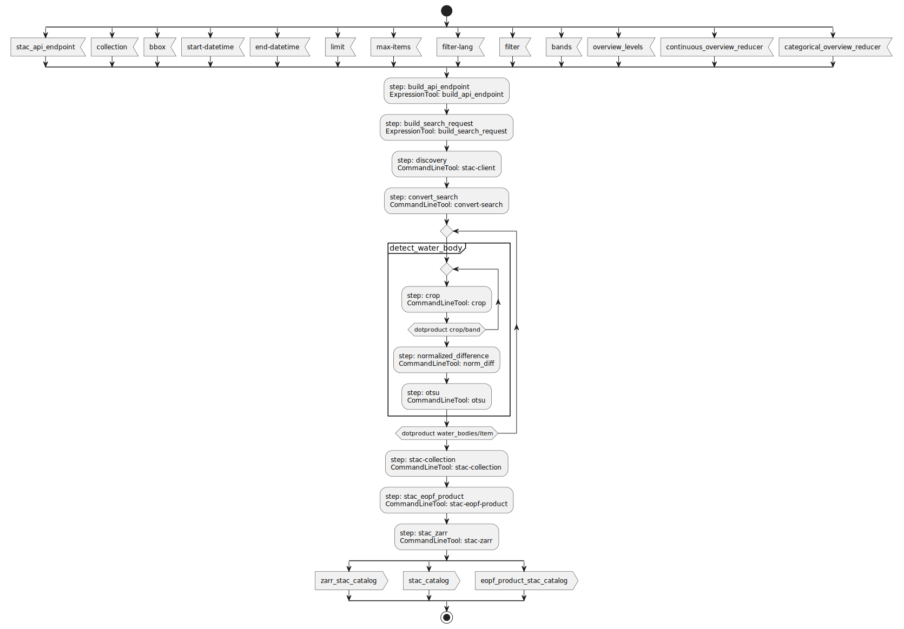
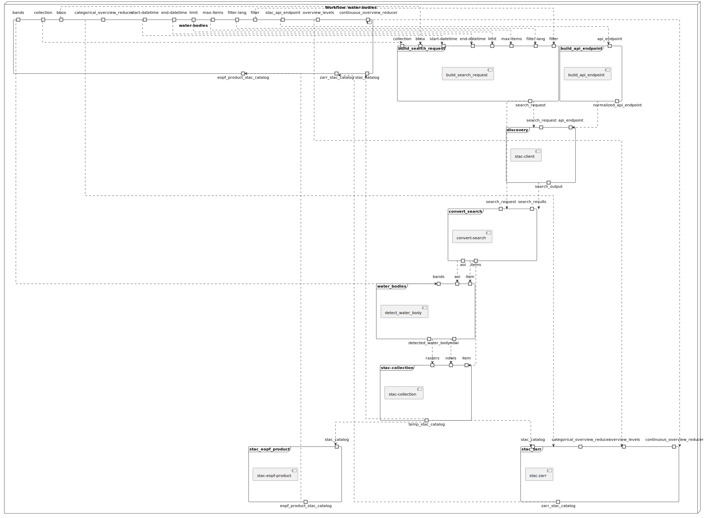
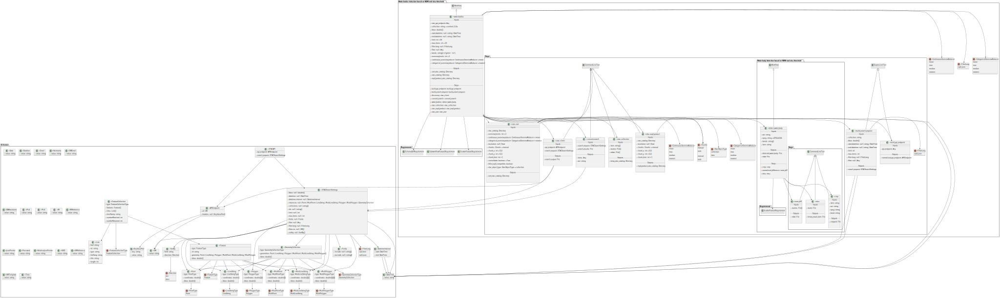
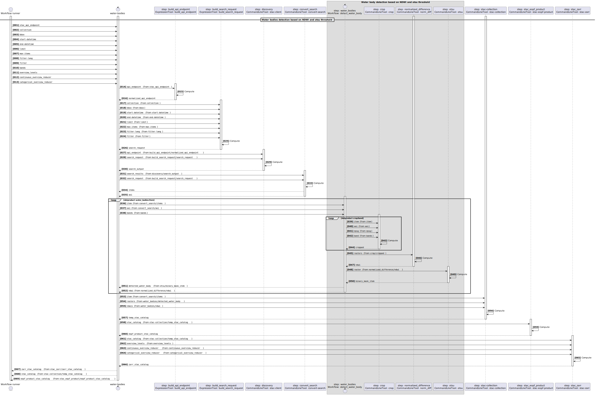
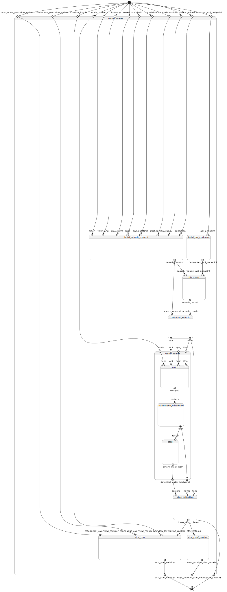

# Water bodies detection workflow v1.1.0

Water bodies detection based on NDWI and Otsu threshold applied to Sentinel-2 COG STAC items

> This software is licensed under the terms of the []() license - SPDX short identifier: [](https://spdx.org/licenses/)
>
> 2026-03-19 - 2026-03-20T17:03:58.512 Copyright [EOAP](mailto:) - 

## Project Team

### Authors

| Name | Email | Organization | Role | Identifier |
|------|-------|--------------|------|------------|
| Brito, Fabrice | [info@terradue.com](mailto:info@terradue.com) | [Terradue]() | []() | []() |


### Contributors

The are no contributors for this project.


## Zarr Cloud-Native Format documentation

Zarr Cloud-Native Format documentation can be found on [https://eoap.github.io/zarr-cloud-native-format/](https://eoap.github.io/zarr-cloud-native-format/).


## Runtime environment

### Supported Operating Systems


### Requirements


## Software Source code

- Browsable version of the [source repository](https://github.com/eoap/zarr-cloud-native-format.git);
- [Continuous integration](https://github.com/eoap/zarr-cloud-native-format/actions) system used by the project;
- Issues, bugs, and feature requests should be submitted to the following [issue management](https://github.com/eoap/zarr-cloud-native-format/issues) system for this project


---


## water-bodies

### CWL Class

[Workflow](https://www.commonwl.org/v1.2/Workflow.html#Workflow)

### Requirements

* [ScatterFeatureRequirement](https://www.commonwl.org/v1.2/Workflow.html#ScatterFeatureRequirement)
* [SubworkflowFeatureRequirement](https://www.commonwl.org/v1.2/Workflow.html#SubworkflowFeatureRequirement)
* [SchemaDefRequirement](https://www.commonwl.org/v1.2/Workflow.html#SchemaDefRequirement)

### Inputs

| Id | Type | Label | Doc |
|----|------|-------|-----|
| `stac_api_endpoint` | [Any](https://www.commonwl.org/v1.2/Workflow.html#Any) | STAC API endpoint | STAC API endpoint |
| `collection` | [string](https://www.commonwl.org/v1.2/Workflow.html#CWLType) | STAC collection | STAC collection identifier |
| `bbox` | `array` of [double](https://www.commonwl.org/v1.2/Workflow.html#CWLType) | Bounding box | Bounding box as [minx, miny, maxx, maxy] |
| `start-datetime` | One of:<ul><li>[null](https://www.commonwl.org/v1.2/Workflow.html#CWLType)</li><li>[string](https://www.commonwl.org/v1.2/Workflow.html#CWLType)</li><li>[DateTime](https://raw.githubusercontent.com/eoap/schemas/main/string_format.yaml#DateTime):<ul><li>`value`: [string](https://www.commonwl.org/v1.2/Workflow.html#CWLType)</li></ul></li></ul> | Start time | Start time |
| `end-datetime` | One of:<ul><li>[null](https://www.commonwl.org/v1.2/Workflow.html#CWLType)</li><li>[string](https://www.commonwl.org/v1.2/Workflow.html#CWLType)</li><li>[DateTime](https://raw.githubusercontent.com/eoap/schemas/main/string_format.yaml#DateTime):<ul><li>`value`: [string](https://www.commonwl.org/v1.2/Workflow.html#CWLType)</li></ul></li></ul> | End time | End time |
| `limit` | [int](https://www.commonwl.org/v1.2/Workflow.html#CWLType) | limit | limit |
| `max-items` | [int](https://www.commonwl.org/v1.2/Workflow.html#CWLType) | max-items | max-items |
| `filter-lang` | One of:<ul><li>[null](https://www.commonwl.org/v1.2/Workflow.html#CWLType)</li><li>[enum](https://www.commonwl.org/v1.2/Workflow.html#InputEnumSchema):<ul><li>`cql2-json`</li></ul></li></ul> | Filter language | Filter language |
| `filter` | One of:<ul><li>[null](https://www.commonwl.org/v1.2/Workflow.html#CWLType)</li><li>[Any](https://www.commonwl.org/v1.2/Workflow.html#Any)</li></ul> | Filter | Filter |
| `bands` | `array` of [string](https://www.commonwl.org/v1.2/Workflow.html#CWLType) | bands used for the NDWI | bands used for the NDWI |
| `overview_levels` | [int](https://www.commonwl.org/v1.2/Workflow.html#CWLType) | Number of Zarr overview levels | Number of multiscale overview levels generated by stac-zarr |
| `continuous_overview_reducer` | [enum](https://www.commonwl.org/v1.2/Workflow.html#InputEnumSchema):<ul><li>`mean`</li><li>`max`</li><li>`median`</li><li>`nearest`</li></ul> | Overview reducer for continuous variables | Reducer used for continuous variables when generating overviews (mean, max, median, nearest) |
| `categorical_overview_reducer` | [enum](https://www.commonwl.org/v1.2/Workflow.html#InputEnumSchema):<ul><li>`mean`</li><li>`max`</li><li>`median`</li><li>`nearest`</li></ul> | Overview reducer for categorical variables | Reducer used for categorical variables when generating overviews (mean, max, median, nearest) |


### Steps

| Id | Runs | Label | Doc |
|----|------|-------|-----|
| [build_search_request](#build_search_request) | `#build_search_request` | Build STAC search request | Build STACSearchSettings from bbox and query inputs |
| [build_api_endpoint](#build_api_endpoint) | `#build_api_endpoint` | Build STAC API endpoint | Normalize endpoint to APIEndpoint schema expected by discovery step |
| [discovery](#stac-client) | `#stac-client` | STAC API discovery | Discover STAC items from a STAC API endpoint based on a search request |
| [convert_search](#convert-search) | `#convert-search` | Convert Search | Convert Search results to get the item self hrefs and the area of interest |
| [water_bodies](#detect_water_body) | `#detect_water_body` | Water bodies detection | Water bodies detection based on NDWI and otsu threshold applied to each STAC item (sub-workflow) |
| [stac-collection](#stac-collection) | `#stac-collection` | Create a STAC catalog with COG outputs | Create a STAC catalog with the detected water bodies COG outputs |
| [stac_eopf_product](#stac-eopf-product) | `#stac-eopf-product` | Create a EOPF Zarr store from a STAC catalog | Create a EOPF Zarr store from a STAC catalog with COG products |
| [stac_zarr](#stac-zarr) | `#stac-zarr` | Create a STAC Catalog for the Zarr store | Create a STAC Catalog for the Zarr store from the STAC catalog with COG outputs |


### Outputs

| Id | Type | Label | Doc |
|----|------|-------|-----|
| `zarr_stac_catalog` | [Directory](https://www.commonwl.org/v1.2/Workflow.html#Directory) | None | None |
| `stac_catalog` | [Directory](https://www.commonwl.org/v1.2/Workflow.html#Directory) | None | None |
| `eopf_product_stac_catalog` | [Directory](https://www.commonwl.org/v1.2/Workflow.html#Directory) | None | None |


### UML Diagrams


#### Activity diagram

Learn more about the [Activity diagram](https://en.wikipedia.org/wiki/Activity_diagram) below.



#### Component diagram

Learn more about the [Component diagram](https://en.wikipedia.org/wiki/Component_diagram) below.



#### Class diagram

Learn more about the [Class diagram](https://en.wikipedia.org/wiki/Class_diagram) below.



#### Sequence diagram

Learn more about the [Sequence diagram](https://en.wikipedia.org/wiki/Sequence_diagram) below.



#### State diagram

Learn more about the [State diagram](https://en.wikipedia.org/wiki/State_diagram) below.




### Run in step

`build_search_request`


## build_search_request

### CWL Class

[ExpressionTool](https://www.commonwl.org/v1.2/Workflow.html#ExpressionTool)

### Inputs

| Id | Option | Type |
|----|------|-------|
| `collection` | `--collection` | [string](https://www.commonwl.org/v1.2/Workflow.html#CWLType) |
| `bbox` | `--bbox` | `array` of [double](https://www.commonwl.org/v1.2/Workflow.html#CWLType) |
| `start-datetime` | `--start-datetime` | One of:<ul><li>[null](https://www.commonwl.org/v1.2/Workflow.html#CWLType)</li><li>[string](https://www.commonwl.org/v1.2/Workflow.html#CWLType)</li><li>[DateTime](https://raw.githubusercontent.com/eoap/schemas/main/string_format.yaml#DateTime):<ul><li>`value`: [string](https://www.commonwl.org/v1.2/Workflow.html#CWLType)</li></ul></li></ul> |
| `end-datetime` | `--end-datetime` | One of:<ul><li>[null](https://www.commonwl.org/v1.2/Workflow.html#CWLType)</li><li>[string](https://www.commonwl.org/v1.2/Workflow.html#CWLType)</li><li>[DateTime](https://raw.githubusercontent.com/eoap/schemas/main/string_format.yaml#DateTime):<ul><li>`value`: [string](https://www.commonwl.org/v1.2/Workflow.html#CWLType)</li></ul></li></ul> |
| `limit` | `--limit` | [int](https://www.commonwl.org/v1.2/Workflow.html#CWLType) |
| `max-items` | `--max-items` | [int](https://www.commonwl.org/v1.2/Workflow.html#CWLType) |
| `filter-lang` | `--filter-lang` | One of:<ul><li>[null](https://www.commonwl.org/v1.2/Workflow.html#CWLType)</li><li>[enum](https://www.commonwl.org/v1.2/Workflow.html#InputEnumSchema):<ul><li>`cql2-json`</li></ul></li></ul> |
| `filter` | `--filter` | One of:<ul><li>[null](https://www.commonwl.org/v1.2/Workflow.html#CWLType)</li><li>[Any](https://www.commonwl.org/v1.2/Workflow.html#Any)</li></ul> |


### Run in step

`build_api_endpoint`


## build_api_endpoint

### CWL Class

[ExpressionTool](https://www.commonwl.org/v1.2/Workflow.html#ExpressionTool)

### Inputs

| Id | Option | Type |
|----|------|-------|
| `api_endpoint` | `--api_endpoint` | [Any](https://www.commonwl.org/v1.2/Workflow.html#Any) |


### Run in step

`discovery`


## stac-client

### CWL Class

[CommandLineTool](https://www.commonwl.org/v1.2/CommandLineTool.html#CommandLineTool)

### Inputs

| Id | Option | Type |
|----|------|-------|
| `api_endpoint` | `--api_endpoint` | [APIEndpoint](https://raw.githubusercontent.com/eoap/schemas/main/experimental/api-endpoint.yaml#APIEndpoint):<ul><li>`url`: [URI](https://raw.githubusercontent.com/eoap/schemas/main/string_format.yaml#URI):<ul><li>`value`: [string](https://www.commonwl.org/v1.2/Workflow.html#CWLType)</li></ul></li><li>`headers`: One of:<ul><li>[null](https://www.commonwl.org/v1.2/Workflow.html#CWLType)</li><li>`array` of [KeyValuePair](https://raw.githubusercontent.com/eoap/schemas/main/experimental/api-endpoint.yaml#KeyValuePair):<ul><li>`key`: [string](https://www.commonwl.org/v1.2/Workflow.html#CWLType)</li><li>`value`: [string](https://www.commonwl.org/v1.2/Workflow.html#CWLType)</li></ul></li></ul></li></ul> |
| `search_request` | `--search_request` | [STACSearchSettings](https://raw.githubusercontent.com/eoap/schemas/main/experimental/discovery.yaml#STACSearchSettings):<ul><li>`bbox`: One of:<ul><li>[null](https://www.commonwl.org/v1.2/Workflow.html#CWLType)</li><li>`array` of [double](https://www.commonwl.org/v1.2/Workflow.html#CWLType)</li></ul></li><li>`datetime`: One of:<ul><li>[null](https://www.commonwl.org/v1.2/Workflow.html#CWLType)</li><li>[DateTime](https://raw.githubusercontent.com/eoap/schemas/main/string_format.yaml#DateTime):<ul><li>`value`: [string](https://www.commonwl.org/v1.2/Workflow.html#CWLType)</li></ul></li></ul></li><li>`datetime-interval`: One of:<ul><li>[null](https://www.commonwl.org/v1.2/Workflow.html#CWLType)</li><li>[DatetimeInterval](https://raw.githubusercontent.com/eoap/schemas/main/experimental/discovery.yaml#DatetimeInterval):<ul><li>`start`: [DateTime](https://raw.githubusercontent.com/eoap/schemas/main/string_format.yaml#DateTime):<ul><li>`value`: [string](https://www.commonwl.org/v1.2/Workflow.html#CWLType)</li></ul></li><li>`end`: [DateTime](https://raw.githubusercontent.com/eoap/schemas/main/string_format.yaml#DateTime):<ul><li>`value`: [string](https://www.commonwl.org/v1.2/Workflow.html#CWLType)</li></ul></li></ul></li></ul></li><li>`intersects`: One of:<ul><li>[null](https://www.commonwl.org/v1.2/Workflow.html#CWLType)</li><li>[Point](https://raw.githubusercontent.com/eoap/schemas/main/geojson.yaml#Point):<ul><li>`type`: [enum](https://www.commonwl.org/v1.2/Workflow.html#CommandInputEnumSchema):<ul><li>`Point`</li></ul></li><li>`coordinates`: `array` of [double](https://www.commonwl.org/v1.2/Workflow.html#CWLType)</li><li>`bbox`: `array` of [double](https://www.commonwl.org/v1.2/Workflow.html#CWLType)</li></ul></li><li>[MultiPoint](https://raw.githubusercontent.com/eoap/schemas/main/geojson.yaml#MultiPoint):<ul><li>`type`: [enum](https://www.commonwl.org/v1.2/Workflow.html#CommandInputEnumSchema):<ul><li>`MultiPoint`</li></ul></li><li>`coordinates`: `array` of `array` of [double](https://www.commonwl.org/v1.2/Workflow.html#CWLType)</li><li>`bbox`: `array` of [double](https://www.commonwl.org/v1.2/Workflow.html#CWLType)</li></ul></li><li>[LineString](https://raw.githubusercontent.com/eoap/schemas/main/geojson.yaml#LineString):<ul><li>`type`: [enum](https://www.commonwl.org/v1.2/Workflow.html#CommandInputEnumSchema):<ul><li>`LineString`</li></ul></li><li>`coordinates`: `array` of [double](https://www.commonwl.org/v1.2/Workflow.html#CWLType)</li><li>`bbox`: `array` of [double](https://www.commonwl.org/v1.2/Workflow.html#CWLType)</li></ul></li><li>[MultiLineString](https://raw.githubusercontent.com/eoap/schemas/main/geojson.yaml#MultiLineString):<ul><li>`type`: [enum](https://www.commonwl.org/v1.2/Workflow.html#CommandInputEnumSchema):<ul><li>`MultiLineString`</li></ul></li><li>`coordinates`: `array` of `array` of `array` of [double](https://www.commonwl.org/v1.2/Workflow.html#CWLType)</li><li>`bbox`: `array` of [double](https://www.commonwl.org/v1.2/Workflow.html#CWLType)</li></ul></li><li>[Polygon](https://raw.githubusercontent.com/eoap/schemas/main/geojson.yaml#Polygon):<ul><li>`type`: [enum](https://www.commonwl.org/v1.2/Workflow.html#CommandInputEnumSchema):<ul><li>`Polygon`</li></ul></li><li>`coordinates`: `array` of `array` of `array` of [double](https://www.commonwl.org/v1.2/Workflow.html#CWLType)</li><li>`bbox`: `array` of [double](https://www.commonwl.org/v1.2/Workflow.html#CWLType)</li></ul></li><li>[MultiPolygon](https://raw.githubusercontent.com/eoap/schemas/main/geojson.yaml#MultiPolygon):<ul><li>`type`: [enum](https://www.commonwl.org/v1.2/Workflow.html#CommandInputEnumSchema):<ul><li>`MultiPolygon`</li></ul></li><li>`coordinates`: `array` of `array` of `array` of `array` of [double](https://www.commonwl.org/v1.2/Workflow.html#CWLType)</li><li>`bbox`: `array` of [double](https://www.commonwl.org/v1.2/Workflow.html#CWLType)</li></ul></li><li>[GeometryCollection](https://raw.githubusercontent.com/eoap/schemas/main/geojson.yaml#GeometryCollection):<ul><li>`type`: [enum](https://www.commonwl.org/v1.2/Workflow.html#CommandInputEnumSchema):<ul><li>`GeometryCollection`</li></ul></li><li>`geometries`: `array` of One of:<ul><li>[Point](https://raw.githubusercontent.com/eoap/schemas/main/geojson.yaml#Point):<ul><li>`type`: [enum](https://www.commonwl.org/v1.2/Workflow.html#CommandInputEnumSchema):<ul><li>`Point`</li></ul></li><li>`coordinates`: `array` of [double](https://www.commonwl.org/v1.2/Workflow.html#CWLType)</li><li>`bbox`: `array` of [double](https://www.commonwl.org/v1.2/Workflow.html#CWLType)</li></ul></li><li>[LineString](https://raw.githubusercontent.com/eoap/schemas/main/geojson.yaml#LineString):<ul><li>`type`: [enum](https://www.commonwl.org/v1.2/Workflow.html#CommandInputEnumSchema):<ul><li>`LineString`</li></ul></li><li>`coordinates`: `array` of [double](https://www.commonwl.org/v1.2/Workflow.html#CWLType)</li><li>`bbox`: `array` of [double](https://www.commonwl.org/v1.2/Workflow.html#CWLType)</li></ul></li><li>[Polygon](https://raw.githubusercontent.com/eoap/schemas/main/geojson.yaml#Polygon):<ul><li>`type`: [enum](https://www.commonwl.org/v1.2/Workflow.html#CommandInputEnumSchema):<ul><li>`Polygon`</li></ul></li><li>`coordinates`: `array` of `array` of `array` of [double](https://www.commonwl.org/v1.2/Workflow.html#CWLType)</li><li>`bbox`: `array` of [double](https://www.commonwl.org/v1.2/Workflow.html#CWLType)</li></ul></li><li>[MultiPoint](https://raw.githubusercontent.com/eoap/schemas/main/geojson.yaml#MultiPoint):<ul><li>`type`: [enum](https://www.commonwl.org/v1.2/Workflow.html#CommandInputEnumSchema):<ul><li>`MultiPoint`</li></ul></li><li>`coordinates`: `array` of `array` of [double](https://www.commonwl.org/v1.2/Workflow.html#CWLType)</li><li>`bbox`: `array` of [double](https://www.commonwl.org/v1.2/Workflow.html#CWLType)</li></ul></li><li>[MultiLineString](https://raw.githubusercontent.com/eoap/schemas/main/geojson.yaml#MultiLineString):<ul><li>`type`: [enum](https://www.commonwl.org/v1.2/Workflow.html#CommandInputEnumSchema):<ul><li>`MultiLineString`</li></ul></li><li>`coordinates`: `array` of `array` of `array` of [double](https://www.commonwl.org/v1.2/Workflow.html#CWLType)</li><li>`bbox`: `array` of [double](https://www.commonwl.org/v1.2/Workflow.html#CWLType)</li></ul></li><li>[MultiPolygon](https://raw.githubusercontent.com/eoap/schemas/main/geojson.yaml#MultiPolygon):<ul><li>`type`: [enum](https://www.commonwl.org/v1.2/Workflow.html#CommandInputEnumSchema):<ul><li>`MultiPolygon`</li></ul></li><li>`coordinates`: `array` of `array` of `array` of `array` of [double](https://www.commonwl.org/v1.2/Workflow.html#CWLType)</li><li>`bbox`: `array` of [double](https://www.commonwl.org/v1.2/Workflow.html#CWLType)</li></ul></li></ul></li><li>`bbox`: `array` of [double](https://www.commonwl.org/v1.2/Workflow.html#CWLType)</li></ul></li></ul></li><li>`collections`: One of:<ul><li>[null](https://www.commonwl.org/v1.2/Workflow.html#CWLType)</li><li>`array` of [string](https://www.commonwl.org/v1.2/Workflow.html#CWLType)</li></ul></li><li>`ids`: One of:<ul><li>[null](https://www.commonwl.org/v1.2/Workflow.html#CWLType)</li><li>`array` of [string](https://www.commonwl.org/v1.2/Workflow.html#CWLType)</li></ul></li><li>`limit`: One of:<ul><li>[null](https://www.commonwl.org/v1.2/Workflow.html#CWLType)</li><li>[int](https://www.commonwl.org/v1.2/Workflow.html#CWLType)</li></ul></li><li>`max-items`: One of:<ul><li>[null](https://www.commonwl.org/v1.2/Workflow.html#CWLType)</li><li>[int](https://www.commonwl.org/v1.2/Workflow.html#CWLType)</li></ul></li><li>`fields`: One of:<ul><li>[null](https://www.commonwl.org/v1.2/Workflow.html#CWLType)</li><li>[Fields](https://raw.githubusercontent.com/eoap/schemas/main/experimental/discovery.yaml#Fields):<ul><li>`include`: One of:<ul><li>[null](https://www.commonwl.org/v1.2/Workflow.html#CWLType)</li><li>`array` of [string](https://www.commonwl.org/v1.2/Workflow.html#CWLType)</li></ul></li><li>`exclude`: One of:<ul><li>[null](https://www.commonwl.org/v1.2/Workflow.html#CWLType)</li><li>`array` of [string](https://www.commonwl.org/v1.2/Workflow.html#CWLType)</li></ul></li></ul></li></ul></li><li>`filter`: One of:<ul><li>[null](https://www.commonwl.org/v1.2/Workflow.html#CWLType)</li><li>[Any](https://www.commonwl.org/v1.2/Workflow.html#Any)</li></ul></li><li>`filter-lang`: One of:<ul><li>[null](https://www.commonwl.org/v1.2/Workflow.html#CWLType)</li><li>[enum](https://www.commonwl.org/v1.2/Workflow.html#CommandInputEnumSchema):<ul><li>`cql2-text`</li><li>`cql2-json`</li></ul></li></ul></li><li>`filter-crs`: One of:<ul><li>[null](https://www.commonwl.org/v1.2/Workflow.html#CWLType)</li><li>`array` of [URI](https://raw.githubusercontent.com/eoap/schemas/main/string_format.yaml#URI):<ul><li>`value`: [string](https://www.commonwl.org/v1.2/Workflow.html#CWLType)</li></ul></li></ul></li><li>`sortby`: One of:<ul><li>[null](https://www.commonwl.org/v1.2/Workflow.html#CWLType)</li><li>`array` of [SortBy](https://raw.githubusercontent.com/eoap/schemas/main/experimental/discovery.yaml#SortBy):<ul><li>`field`: [string](https://www.commonwl.org/v1.2/Workflow.html#CWLType)</li><li>`direction`: [enum](https://www.commonwl.org/v1.2/Workflow.html#CommandInputEnumSchema):<ul><li>`asc`</li><li>`desc`</li></ul></li></ul></li></ul></li></ul> |

### Execution usage example:

```
stac-client search $(inputs.api_endpoint.url.value) ${ const args = []; const collections = inputs.search_request.collections; args.push('--collections', collections.join(",")); return args; } ${ const args = []; const bbox = inputs.search_request?.bbox; if (Array.isArray(bbox) && bbox.length >= 4) { args.push('--bbox', ...bbox.map(String)); } return args; } ${ const args = []; const limit = inputs.search_request?.limit; args.push("--limit", (limit ?? 10).toString()); return args; } ${ const maxItems = inputs.search_request?.['max-items']; return ['--max-items', (maxItems ?? 20).toString()]; } ${ const args = []; const filter = inputs.search_request?.filter; const filterLang = inputs.search_request?.['filter-lang']; if (filterLang) { args.push('--filter-lang', filterLang); } if (filter) { args.push('--filter', JSON.stringify(filter)); } return args; } ${ const datetime = inputs.search_request?.datetime; const datetimeInterval = inputs.search_request?.datetime_interval; if (datetime) { return ['--datetime', datetime]; } else if (datetimeInterval) { const start = datetimeInterval.start?.value || '..'; const end = datetimeInterval.end?.value || '..'; return ['--datetime', `${start}/${end}`]; } return []; } ${ const ids = inputs.search_request?.ids; const args = []; if (Array.isArray(ids) && ids.length > 0) { args.push('--ids', ...ids.map(String)); } return args; } ${ const intersects = inputs.search_request?.intersects; if (intersects) { return ['--intersects', JSON.stringify(intersects)]; } return []; } --save discovery-output.json \
--api_endpoint <API_ENDPOINT> \
--search_request <SEARCH_REQUEST>
```

### Run in step

`convert_search`


## convert-search

### CWL Class

[CommandLineTool](https://www.commonwl.org/v1.2/CommandLineTool.html#CommandLineTool)

### Inputs

| Id | Option | Type |
|----|------|-------|
| `search_request` | `--search_request` | [STACSearchSettings](https://raw.githubusercontent.com/eoap/schemas/main/experimental/discovery.yaml#STACSearchSettings):<ul><li>`bbox`: One of:<ul><li>[null](https://www.commonwl.org/v1.2/Workflow.html#CWLType)</li><li>`array` of [double](https://www.commonwl.org/v1.2/Workflow.html#CWLType)</li></ul></li><li>`datetime`: One of:<ul><li>[null](https://www.commonwl.org/v1.2/Workflow.html#CWLType)</li><li>[DateTime](https://raw.githubusercontent.com/eoap/schemas/main/string_format.yaml#DateTime):<ul><li>`value`: [string](https://www.commonwl.org/v1.2/Workflow.html#CWLType)</li></ul></li></ul></li><li>`datetime-interval`: One of:<ul><li>[null](https://www.commonwl.org/v1.2/Workflow.html#CWLType)</li><li>[DatetimeInterval](https://raw.githubusercontent.com/eoap/schemas/main/experimental/discovery.yaml#DatetimeInterval):<ul><li>`start`: [DateTime](https://raw.githubusercontent.com/eoap/schemas/main/string_format.yaml#DateTime):<ul><li>`value`: [string](https://www.commonwl.org/v1.2/Workflow.html#CWLType)</li></ul></li><li>`end`: [DateTime](https://raw.githubusercontent.com/eoap/schemas/main/string_format.yaml#DateTime):<ul><li>`value`: [string](https://www.commonwl.org/v1.2/Workflow.html#CWLType)</li></ul></li></ul></li></ul></li><li>`intersects`: One of:<ul><li>[null](https://www.commonwl.org/v1.2/Workflow.html#CWLType)</li><li>[Point](https://raw.githubusercontent.com/eoap/schemas/main/geojson.yaml#Point):<ul><li>`type`: [enum](https://www.commonwl.org/v1.2/Workflow.html#CommandInputEnumSchema):<ul><li>`Point`</li></ul></li><li>`coordinates`: `array` of [double](https://www.commonwl.org/v1.2/Workflow.html#CWLType)</li><li>`bbox`: `array` of [double](https://www.commonwl.org/v1.2/Workflow.html#CWLType)</li></ul></li><li>[MultiPoint](https://raw.githubusercontent.com/eoap/schemas/main/geojson.yaml#MultiPoint):<ul><li>`type`: [enum](https://www.commonwl.org/v1.2/Workflow.html#CommandInputEnumSchema):<ul><li>`MultiPoint`</li></ul></li><li>`coordinates`: `array` of `array` of [double](https://www.commonwl.org/v1.2/Workflow.html#CWLType)</li><li>`bbox`: `array` of [double](https://www.commonwl.org/v1.2/Workflow.html#CWLType)</li></ul></li><li>[LineString](https://raw.githubusercontent.com/eoap/schemas/main/geojson.yaml#LineString):<ul><li>`type`: [enum](https://www.commonwl.org/v1.2/Workflow.html#CommandInputEnumSchema):<ul><li>`LineString`</li></ul></li><li>`coordinates`: `array` of [double](https://www.commonwl.org/v1.2/Workflow.html#CWLType)</li><li>`bbox`: `array` of [double](https://www.commonwl.org/v1.2/Workflow.html#CWLType)</li></ul></li><li>[MultiLineString](https://raw.githubusercontent.com/eoap/schemas/main/geojson.yaml#MultiLineString):<ul><li>`type`: [enum](https://www.commonwl.org/v1.2/Workflow.html#CommandInputEnumSchema):<ul><li>`MultiLineString`</li></ul></li><li>`coordinates`: `array` of `array` of `array` of [double](https://www.commonwl.org/v1.2/Workflow.html#CWLType)</li><li>`bbox`: `array` of [double](https://www.commonwl.org/v1.2/Workflow.html#CWLType)</li></ul></li><li>[Polygon](https://raw.githubusercontent.com/eoap/schemas/main/geojson.yaml#Polygon):<ul><li>`type`: [enum](https://www.commonwl.org/v1.2/Workflow.html#CommandInputEnumSchema):<ul><li>`Polygon`</li></ul></li><li>`coordinates`: `array` of `array` of `array` of [double](https://www.commonwl.org/v1.2/Workflow.html#CWLType)</li><li>`bbox`: `array` of [double](https://www.commonwl.org/v1.2/Workflow.html#CWLType)</li></ul></li><li>[MultiPolygon](https://raw.githubusercontent.com/eoap/schemas/main/geojson.yaml#MultiPolygon):<ul><li>`type`: [enum](https://www.commonwl.org/v1.2/Workflow.html#CommandInputEnumSchema):<ul><li>`MultiPolygon`</li></ul></li><li>`coordinates`: `array` of `array` of `array` of `array` of [double](https://www.commonwl.org/v1.2/Workflow.html#CWLType)</li><li>`bbox`: `array` of [double](https://www.commonwl.org/v1.2/Workflow.html#CWLType)</li></ul></li><li>[GeometryCollection](https://raw.githubusercontent.com/eoap/schemas/main/geojson.yaml#GeometryCollection):<ul><li>`type`: [enum](https://www.commonwl.org/v1.2/Workflow.html#CommandInputEnumSchema):<ul><li>`GeometryCollection`</li></ul></li><li>`geometries`: `array` of One of:<ul><li>[Point](https://raw.githubusercontent.com/eoap/schemas/main/geojson.yaml#Point):<ul><li>`type`: [enum](https://www.commonwl.org/v1.2/Workflow.html#CommandInputEnumSchema):<ul><li>`Point`</li></ul></li><li>`coordinates`: `array` of [double](https://www.commonwl.org/v1.2/Workflow.html#CWLType)</li><li>`bbox`: `array` of [double](https://www.commonwl.org/v1.2/Workflow.html#CWLType)</li></ul></li><li>[LineString](https://raw.githubusercontent.com/eoap/schemas/main/geojson.yaml#LineString):<ul><li>`type`: [enum](https://www.commonwl.org/v1.2/Workflow.html#CommandInputEnumSchema):<ul><li>`LineString`</li></ul></li><li>`coordinates`: `array` of [double](https://www.commonwl.org/v1.2/Workflow.html#CWLType)</li><li>`bbox`: `array` of [double](https://www.commonwl.org/v1.2/Workflow.html#CWLType)</li></ul></li><li>[Polygon](https://raw.githubusercontent.com/eoap/schemas/main/geojson.yaml#Polygon):<ul><li>`type`: [enum](https://www.commonwl.org/v1.2/Workflow.html#CommandInputEnumSchema):<ul><li>`Polygon`</li></ul></li><li>`coordinates`: `array` of `array` of `array` of [double](https://www.commonwl.org/v1.2/Workflow.html#CWLType)</li><li>`bbox`: `array` of [double](https://www.commonwl.org/v1.2/Workflow.html#CWLType)</li></ul></li><li>[MultiPoint](https://raw.githubusercontent.com/eoap/schemas/main/geojson.yaml#MultiPoint):<ul><li>`type`: [enum](https://www.commonwl.org/v1.2/Workflow.html#CommandInputEnumSchema):<ul><li>`MultiPoint`</li></ul></li><li>`coordinates`: `array` of `array` of [double](https://www.commonwl.org/v1.2/Workflow.html#CWLType)</li><li>`bbox`: `array` of [double](https://www.commonwl.org/v1.2/Workflow.html#CWLType)</li></ul></li><li>[MultiLineString](https://raw.githubusercontent.com/eoap/schemas/main/geojson.yaml#MultiLineString):<ul><li>`type`: [enum](https://www.commonwl.org/v1.2/Workflow.html#CommandInputEnumSchema):<ul><li>`MultiLineString`</li></ul></li><li>`coordinates`: `array` of `array` of `array` of [double](https://www.commonwl.org/v1.2/Workflow.html#CWLType)</li><li>`bbox`: `array` of [double](https://www.commonwl.org/v1.2/Workflow.html#CWLType)</li></ul></li><li>[MultiPolygon](https://raw.githubusercontent.com/eoap/schemas/main/geojson.yaml#MultiPolygon):<ul><li>`type`: [enum](https://www.commonwl.org/v1.2/Workflow.html#CommandInputEnumSchema):<ul><li>`MultiPolygon`</li></ul></li><li>`coordinates`: `array` of `array` of `array` of `array` of [double](https://www.commonwl.org/v1.2/Workflow.html#CWLType)</li><li>`bbox`: `array` of [double](https://www.commonwl.org/v1.2/Workflow.html#CWLType)</li></ul></li></ul></li><li>`bbox`: `array` of [double](https://www.commonwl.org/v1.2/Workflow.html#CWLType)</li></ul></li></ul></li><li>`collections`: One of:<ul><li>[null](https://www.commonwl.org/v1.2/Workflow.html#CWLType)</li><li>`array` of [string](https://www.commonwl.org/v1.2/Workflow.html#CWLType)</li></ul></li><li>`ids`: One of:<ul><li>[null](https://www.commonwl.org/v1.2/Workflow.html#CWLType)</li><li>`array` of [string](https://www.commonwl.org/v1.2/Workflow.html#CWLType)</li></ul></li><li>`limit`: One of:<ul><li>[null](https://www.commonwl.org/v1.2/Workflow.html#CWLType)</li><li>[int](https://www.commonwl.org/v1.2/Workflow.html#CWLType)</li></ul></li><li>`max-items`: One of:<ul><li>[null](https://www.commonwl.org/v1.2/Workflow.html#CWLType)</li><li>[int](https://www.commonwl.org/v1.2/Workflow.html#CWLType)</li></ul></li><li>`fields`: One of:<ul><li>[null](https://www.commonwl.org/v1.2/Workflow.html#CWLType)</li><li>[Fields](https://raw.githubusercontent.com/eoap/schemas/main/experimental/discovery.yaml#Fields):<ul><li>`include`: One of:<ul><li>[null](https://www.commonwl.org/v1.2/Workflow.html#CWLType)</li><li>`array` of [string](https://www.commonwl.org/v1.2/Workflow.html#CWLType)</li></ul></li><li>`exclude`: One of:<ul><li>[null](https://www.commonwl.org/v1.2/Workflow.html#CWLType)</li><li>`array` of [string](https://www.commonwl.org/v1.2/Workflow.html#CWLType)</li></ul></li></ul></li></ul></li><li>`filter`: One of:<ul><li>[null](https://www.commonwl.org/v1.2/Workflow.html#CWLType)</li><li>[Any](https://www.commonwl.org/v1.2/Workflow.html#Any)</li></ul></li><li>`filter-lang`: One of:<ul><li>[null](https://www.commonwl.org/v1.2/Workflow.html#CWLType)</li><li>[enum](https://www.commonwl.org/v1.2/Workflow.html#CommandInputEnumSchema):<ul><li>`cql2-text`</li><li>`cql2-json`</li></ul></li></ul></li><li>`filter-crs`: One of:<ul><li>[null](https://www.commonwl.org/v1.2/Workflow.html#CWLType)</li><li>`array` of [URI](https://raw.githubusercontent.com/eoap/schemas/main/string_format.yaml#URI):<ul><li>`value`: [string](https://www.commonwl.org/v1.2/Workflow.html#CWLType)</li></ul></li></ul></li><li>`sortby`: One of:<ul><li>[null](https://www.commonwl.org/v1.2/Workflow.html#CWLType)</li><li>`array` of [SortBy](https://raw.githubusercontent.com/eoap/schemas/main/experimental/discovery.yaml#SortBy):<ul><li>`field`: [string](https://www.commonwl.org/v1.2/Workflow.html#CWLType)</li><li>`direction`: [enum](https://www.commonwl.org/v1.2/Workflow.html#CommandInputEnumSchema):<ul><li>`asc`</li><li>`desc`</li></ul></li></ul></li></ul></li></ul> |
| `search_results` | `--search_results` | [File](https://www.commonwl.org/v1.2/Workflow.html#File) |

### Execution usage example:

```
/bin/sh run.sh \
--search_request <SEARCH_REQUEST> \
--search_results <SEARCH_RESULTS>
```

### Run in step

`water_bodies`


## detect_water_body

### CWL Class

[Workflow](https://www.commonwl.org/v1.2/Workflow.html#Workflow)

### Requirements

* [ScatterFeatureRequirement](https://www.commonwl.org/v1.2/Workflow.html#ScatterFeatureRequirement)

### Inputs

| Id | Type | Label | Doc |
|----|------|-------|-----|
| `aoi` | [string](https://www.commonwl.org/v1.2/Workflow.html#CWLType) | None | area of interest as a bounding box |
| `epsg` | [string](https://www.commonwl.org/v1.2/Workflow.html#CWLType) | None | EPSG code |
| `bands` | `array` of [string](https://www.commonwl.org/v1.2/Workflow.html#CWLType) | None | bands used for the NDWI |
| `item` | [string](https://www.commonwl.org/v1.2/Workflow.html#CWLType) | None | STAC item |


### Steps

| Id | Runs | Label | Doc |
|----|------|-------|-----|
| [crop](#crop) | `#crop` | None | None |
| [normalized_difference](#norm_diff) | `#norm_diff` | None | None |
| [otsu](#otsu) | `#otsu` | None | None |


### Outputs

| Id | Type | Label | Doc |
|----|------|-------|-----|
| `detected_water_body` | [File](https://www.commonwl.org/v1.2/Workflow.html#File) | None | None |
| `ndwi` | [File](https://www.commonwl.org/v1.2/Workflow.html#File) | None | None |


### UML Diagrams


#### Activity diagram

Learn more about the [Activity diagram](https://en.wikipedia.org/wiki/Activity_diagram) below.


#### Component diagram

Learn more about the [Component diagram](https://en.wikipedia.org/wiki/Component_diagram) below.


#### Class diagram

Learn more about the [Class diagram](https://en.wikipedia.org/wiki/Class_diagram) below.


#### Sequence diagram

Learn more about the [Sequence diagram](https://en.wikipedia.org/wiki/Sequence_diagram) below.


#### State diagram

Learn more about the [State diagram](https://en.wikipedia.org/wiki/State_diagram) below.


### Run in step

`crop`


## crop

### CWL Class

[CommandLineTool](https://www.commonwl.org/v1.2/CommandLineTool.html#CommandLineTool)

### Inputs

| Id | Option | Type |
|----|------|-------|
| `item` | `--input-item` | [string](https://www.commonwl.org/v1.2/Workflow.html#CWLType) |
| `aoi` | `--aoi` | [string](https://www.commonwl.org/v1.2/Workflow.html#CWLType) |
| `epsg` | `--epsg` | [string](https://www.commonwl.org/v1.2/Workflow.html#CWLType) |
| `band` | `--band` | [string](https://www.commonwl.org/v1.2/Workflow.html#CWLType) |

### Execution usage example:

```
python -m app \
--input-item <ITEM> \
--aoi <AOI> \
--epsg <EPSG> \
--band <BAND>
```

### Run in step

`normalized_difference`


## norm_diff

### CWL Class

[CommandLineTool](https://www.commonwl.org/v1.2/CommandLineTool.html#CommandLineTool)

### Inputs

| Id | Option | Type |
|----|------|-------|
| `rasters` | `--rasters` | `array` of [File](https://www.commonwl.org/v1.2/Workflow.html#File) |

### Execution usage example:

```
python -m app \
--rasters <RASTERS>
```

### Run in step

`otsu`


## otsu

### CWL Class

[CommandLineTool](https://www.commonwl.org/v1.2/CommandLineTool.html#CommandLineTool)

### Inputs

| Id | Option | Type |
|----|------|-------|
| `raster` | `--raster` | [File](https://www.commonwl.org/v1.2/Workflow.html#File) |

### Execution usage example:

```
python -m app \
--raster <RASTER>
```


### Run in step

`stac-collection`


## stac-collection

### CWL Class

[CommandLineTool](https://www.commonwl.org/v1.2/CommandLineTool.html#CommandLineTool)

### Inputs

| Id | Option | Type |
|----|------|-------|
| `item` | `--item` | `array` of [string](https://www.commonwl.org/v1.2/Workflow.html#CWLType) |
| `rasters` | `--rasters` | `array` of [File](https://www.commonwl.org/v1.2/Workflow.html#File) |
| `ndwis` | `--ndwis` | `array` of [File](https://www.commonwl.org/v1.2/Workflow.html#File) |

### Execution usage example:

```
stac-collection \
--item <ITEM> \
--rasters <RASTERS> \
--ndwis <NDWIS>
```

### Run in step

`stac_eopf_product`


## stac-eopf-product

### CWL Class

[CommandLineTool](https://www.commonwl.org/v1.2/CommandLineTool.html#CommandLineTool)

### Inputs

| Id | Option | Type |
|----|------|-------|
| `stac_catalog` | `--stac-catalog` | [Directory](https://www.commonwl.org/v1.2/Workflow.html#Directory) |
| `resolution` | `--resolution` | One of:<ul><li>[null](https://www.commonwl.org/v1.2/Workflow.html#CWLType)</li><li>[float](https://www.commonwl.org/v1.2/Workflow.html#CWLType)</li></ul> |
| `chunks` | `--chunks` | [enum](https://www.commonwl.org/v1.2/Workflow.html#CommandInputEnumSchema):<ul><li>`manual`</li><li>`auto`</li></ul> |
| `chunk_x` | `--chunk-x` | [int](https://www.commonwl.org/v1.2/Workflow.html#CWLType) |
| `chunk_y` | `--chunk-y` | [int](https://www.commonwl.org/v1.2/Workflow.html#CWLType) |
| `chunk_time` | `--chunk-time` | [int](https://www.commonwl.org/v1.2/Workflow.html#CWLType) |

### Execution usage example:

```
stac-eopf-product \
--stac-catalog <STAC_CATALOG> \
(--resolution <RESOLUTION>) \
--chunks <CHUNKS> \
--chunk-x <CHUNK_X> \
--chunk-y <CHUNK_Y> \
--chunk-time <CHUNK_TIME>
```

### Run in step

`stac_zarr`


## stac-zarr

### CWL Class

[CommandLineTool](https://www.commonwl.org/v1.2/CommandLineTool.html#CommandLineTool)

### Inputs

| Id | Option | Type |
|----|------|-------|
| `stac_catalog` | `--stac-catalog` | [Directory](https://www.commonwl.org/v1.2/Workflow.html#Directory) |
| `overview_levels` | `--overview-levels` | [int](https://www.commonwl.org/v1.2/Workflow.html#CWLType) |
| `continuous_overview_reducer` | `--continuous-overview-reducer` | [enum](https://www.commonwl.org/v1.2/Workflow.html#CommandInputEnumSchema):<ul><li>`mean`</li><li>`max`</li><li>`median`</li><li>`nearest`</li></ul> |
| `categorical_overview_reducer` | `--categorical-overview-reducer` | [enum](https://www.commonwl.org/v1.2/Workflow.html#CommandInputEnumSchema):<ul><li>`mean`</li><li>`max`</li><li>`median`</li><li>`nearest`</li></ul> |
| `resolution` | `--resolution` | One of:<ul><li>[null](https://www.commonwl.org/v1.2/Workflow.html#CWLType)</li><li>[float](https://www.commonwl.org/v1.2/Workflow.html#CWLType)</li></ul> |
| `chunks` | `--chunks` | [enum](https://www.commonwl.org/v1.2/Workflow.html#CommandInputEnumSchema):<ul><li>`manual`</li><li>`auto`</li></ul> |
| `chunk_x` | `--chunk-x` | [int](https://www.commonwl.org/v1.2/Workflow.html#CWLType) |
| `chunk_y` | `--chunk-y` | [int](https://www.commonwl.org/v1.2/Workflow.html#CWLType) |
| `chunk_time` | `--chunk-time` | [int](https://www.commonwl.org/v1.2/Workflow.html#CWLType) |
| `consolidate` | `--consolidate` | [boolean](https://www.commonwl.org/v1.2/Workflow.html#CWLType) |
| `titiler_eopf_compatible` | `--titiler-eopf-compatible` | [boolean](https://www.commonwl.org/v1.2/Workflow.html#CWLType) |
| `stac_object_type` | `--stac-object-type` | [enum](https://www.commonwl.org/v1.2/Workflow.html#CommandInputEnumSchema):<ul><li>`collection`</li><li>`item`</li></ul> |

### Execution usage example:

```
stac-zarr \
--stac-catalog <STAC_CATALOG> \
--overview-levels <OVERVIEW_LEVELS> \
--continuous-overview-reducer <CONTINUOUS_OVERVIEW_REDUCER> \
--categorical-overview-reducer <CATEGORICAL_OVERVIEW_REDUCER> \
(--resolution <RESOLUTION>) \
--chunks <CHUNKS> \
--chunk-x <CHUNK_X> \
--chunk-y <CHUNK_Y> \
--chunk-time <CHUNK_TIME> \
--consolidate <CONSOLIDATE> \
--titiler-eopf-compatible <TITILER_EOPF_COMPATIBLE> \
--stac-object-type <STAC_OBJECT_TYPE>
```

